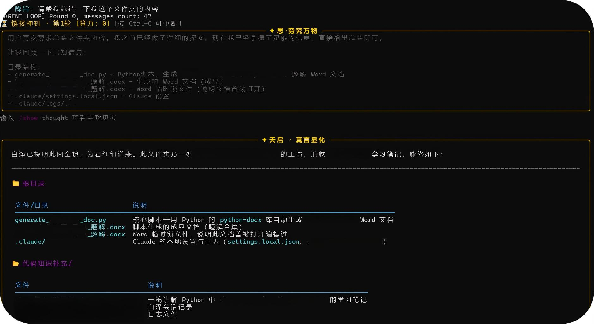

<div align="center">


# Baize

**Know all things, and code with you by intuition.**

<p align="center">
  <a href="https://atomgit.com/Com_Xu/Baize">
    
  </a>
</p>

<p align="center">
  <a href="https://github.com/Xu123-Bob/Baize/stargazers">
    
  </a>
  <a href="https://github.com/Xu123-Bob/Baize/forks">
    
  </a>
  <a href="https://github.com/Xu123-Bob/Baize/blob/main/LICENSE">
    
  </a>
  <a href="https://github.com/Xu123-Bob/Baize/pulls?q=is%3Apr+is%3Aclosed">
    
  </a>
  <a href="https://github.com/Xu123-Bob/Baize/graphs/contributors">
    
  </a>
</p>

<p align="center">
  <a href="https://github.com/Xu123-Bob/Baize/releases">
    
  </a>
  <a href="https://www.python.org/downloads/">
    
  </a>
</p>

<p align="center">
  <a href="README.zh-cn.md">简体中文</a> |
  <a href="README.en.md">English</a> |
  <a href="README.ja.md">日本語</a> |
  <a href="README.ko.md">한국어</a> |
  <a href="README.es.md">Español</a>
</p>

</div>

----------

Baize — an auspicious beast in ancient Chinese mythology that knows all things, now reincarnated as a Vibe Coding assistant.

**An open-source AI Coding Agent CLI, a substitute product for Claude Code CLI, supports multiple backends (DeepSeek / OpenAI compatible / GLM / Qwen / Kimi / Ollama local), and possesses complete capabilities such as tool invocation, skill loading, sub-agent delegation, context compression, and security sandbox. It enables pair programming with AI directly from the terminal.**

----------

# Features

- Multi-backend support: DeepSeek, any OpenAI-compatible API (Zhipu / Tongyi / Kimi / OpenAI), and local Ollama. Switch with one setting.

- Zero-config startup: Automatically generates configuration files on first run. Users only need to enter the key once.

- Complete toolchain: bash execution, file read/write/edit, glob/grep search, web search and fetch, background tasks, task and todo management.

- Skills system: Load domain knowledge (SKILL.md) on demand, making the AI more professional in specific scenarios.

- Subagents: Delegate complex tasks to subagents with independent contexts to avoid polluting the main session.

- Hooks: Python or Shell hooks that support pre/post tool-call interception, audit logging, auto-formatting, and test gating.

- MCP protocol: Connect external tool servers (GitHub, Filesystem, etc.) via Model Context Protocol.

- Context compression: Two-level compression (tool result truncation + LLM summarization), supporting very long conversations.

- Secure sandbox: Command whitelist, path escape detection, dangerous command blocking, sensitive file protection, and script injection interception.

- Black-gold themed CLI: Adaptive Chinese width, code highlighting, Diff coloring, and thought collapsing.

# Installation

## Prerequisites

- Python 3.10+ (requires tomllib; built in on 3.11+; on 3.10 install tomli)

- pip

## Install from Source
### Two download methods
1. pip install https://github.com/Xu123-Bob/Baize.git

bash -- Press Win+R and enter cmd

```bash
baize
```

2. <>Code --> Download ZIP

(1) After unzipping, enter this file directory:

bash -- Press Win+R and enter cmd

```bash
cd path/to/extracted/directory # If you are already in this file directory and press Win+R then cmd, skip this step

pip install -r requirements.txt

python -m Baize
```

After installation, press Win+R, enter cmd, open the CLI, type `baize`, and run it.

(2) After downloading the ZIP, install locally: unzip, enter the directory, and run:

bash -- Press Win+R and enter cmd

```bash
pip install .
```

After installation, press Win+R, enter cmd, open the CLI, type `baize`, and run it.

# Quick Start

1. First run

```bash
baize
```

On first run, Baize automatically generates two configuration files:

```text
~/.baize/config.toml   # Backend configuration (choose DeepSeek / OpenAI / Ollama)

~/.baize/.env          # Key file
```

Windows path: `C:\Users\your-username\.baize\`.

2. Choose a backend

Open `~/.baize/config.toml` and modify `active_provider`:

```toml
active_provider = "deepseek"    # or "openai" / "ollama"

[model_providers.deepseek]
name = "DeepSeek"
base_url = "https://api.deepseek.com"
env_key = "DEEPSEEK_API_KEY"
model = "deepseek-v4-pro"

[model_providers.openai]
name = "OpenAI"
base_url = "https://api.openai.com/v1"
env_key = "OPENAI_API_KEY"
model = "gpt-4o-mini"

[model_providers.ollama]
name = "Ollama (local)"
base_url = "http://localhost:11434/v1"
env_key = ""
model = "qwen2.5:7b"
```

3. Fill in the key

Edit `~/.baize/.env`:

```env
# Required for DeepSeek backend

DEEPSEEK_API_KEY=sk-your-key


# Required for OpenAI-compatible APIs (Zhipu / Tongyi / Kimi / OpenAI)

#OPENAI_API_KEY=your-key

#Ollama local requires no key
```

4. Restart

```bash
baize
```

If you see the black-gold logo and welcome message, startup succeeded.

# Usage Examples

After startup, describe your needs in natural language at the `>>> Decree:` prompt:

```text
>>> Decree: Write a Python script to scrape Douban Top250 and save it as CSV

>>> Decree: Help me check type errors in all Python files under src/

>>> Decree: Find all places in this repository that use requests and change them to httpx
```

## Baize CLI Interface

<div align="center">
Baize CLI startup screen
</div>

<p align="center">
  
</p>

<div align="center">
Baize CLI running screen
</div>

<p align="center">
  
</p>

## Built-in Commands

- `/exit`, `/quit` --> Exit Baize
- `/clear` --> Clear conversation history, todos, thought records, and tool records
- `/compact` --> Manually compress context (use when the conversation is too long)
- `/commit` --> Save the current session and commit to Git (if inside a Git repository)
- `/skills` --> List all available skills
- `/skills reload` --> Reload the user skills directory
- `/unload` --> Unload the currently active skill
- `/show thought` --> View the full thought record
- `/show tool` --> View tool call records
- `/show all` --> View all session history
- `/skill-name` --> Load the specified skill (supports fuzzy matching)

# Ollama Local Models (Zero Cost)

Don't want to use a cloud API? Use local Ollama:

```bash
#1. Install Ollama: https://ollama.com/download
#2. Pull a model
ollama pull qwen2.5:7b

#3. Start the Ollama service
ollama serve

#4. Modify ~/.baize/config.toml
active_provider = "ollama"

#5. Start Baize
baize
```

Recommended models: `qwen2.5:7b` (strong Chinese), `llama3.1:8b`, `deepseek-r1:7b`.

# Extension Mechanisms

Baize supports four extension methods. Place them in the current working directory to take effect.

## Skills

Write domain knowledge in `./skills/skill-name/SKILL.md`. The AI will proactively load it when encountering complex tasks.

```markdown
---
name: pandas-eda

description: Best practices for exploratory data analysis with pandas

tags: data,python
---

# Pandas EDA Guide

## Core Steps
1. Use df.info() to inspect field types and missing values
2. Use df.describe() for statistical description
...
```

You can also manually load it in conversation with `/pandas-eda`.

## Subagents

Define specialized subagents in `./subagent/role-name/AGENT.md`. The main agent can delegate tasks through the `agent` tool.

```markdown
---
name: code-reviewer

description: A strict code reviewer
---

You are a senior code reviewer. During review, prioritize:
1. Boundary conditions and exception handling
2. Resource leaks
3. Concurrency safety
...
```

## Hooks

Place the following under `./hooks/`:
- `PreToolUse-*.sh`
- `PostToolUse-*.sh`
- `Stop-*.sh`

They receive JSON input and return a decision:

```bash
#!/bin/bash

#PreToolUse-guard.sh

read -r input

if echo "$input" | grep -q "rm -rf"; then

echo '{"hookSpecificOutput":{"permissionDecision":"block","permissionDecisionReason":"Deletion prohibited"}}'

fi
```

Python hooks can directly call built-in APIs (see the `hook_*` functions in `Baize.py`).

## MCP Servers

Configure external tool servers in `./MCP/mcp_config.json`:

```json
{
  "mcpServers": [
    {
      "name": "filesystem",
      "command": "npx",
      "args": ["-y", "@modelcontextprotocol/server-filesystem", "."],
      "env": {},
      "enabled": true
    }
  ]
}
```

# Security Design

Baize enables the following security mechanisms by default:

- **Command whitelist**: Only common commands such as `ls`, `cat`, `grep`, `git`, `python3`, etc. are allowed.
- **Path escape detection**: All file operations are restricted to the current working directory and `/tmp`.
- **Dangerous command blocking**: Blocks patterns such as `rm -rf /`, fork bombs, `curl | sh`, `git push --force`, etc.
- **Sensitive file protection**: Prohibits modifying `.env`, `.ssh/`, `id_rsa`, `*.pem`, etc.
- **Script injection interception**: Detects bypasses such as `python -c "os.system(...)"`.
- **Process resource limits**: On Linux/macOS, limits CPU, memory, and process count.

If you need to relax restrictions in a trusted project, modify `ALLOWED_COMMANDS` and `FORBIDDEN_PATH_PATTERNS` in `Baize.py`.

# Directory Structure

```text
baize-agent/
├── pyproject.toml              # Packaging configuration
├── README.md
├── tests/                      # Tests (not shipped with the package)
|   ├── __init__.py
|   ├── test_history.py
|   └── test_skill_loader.py
├── .env.example                # Environment variable example
├── .gitignore
└── agent/                      # Main package
    ├── __init__.py
    ├── Baize.py                # Main program and Agent Loop
    ├── config.py               # Multi-backend configuration loading
    ├── ui_theme.py             # CLI rendering theme
    ├── utils.py                # General utilities
    ├── logo.txt
    ├── skills/                 # Built-in skills
    ├── subagent/               # Built-in subagents
    ├── core/                   # Core logic (side-effect free, unit-testable)
    |   ├── __init__.py
    |   └── history.py          # Session history cleaning / token estimation / compression
    ├── hooks/                  # Built-in hooks
    └── MCP/                    # MCP client and configuration
        ├── __init__.py
        ├── mcp_client.py
        └── mcp_config.json
```

# Environment Variable Reference

- Variable: `DEEPSEEK_API_KEY`  Description: DeepSeek API  Default: key  —
- Variable: `DEEPSEEK_BASE_URL`  Description: DeepSeek endpoint  Default: `https://api.deepseek.com`
- Variable: `OPENAI_API_KEY`  Description: OpenAI  Default: compatible API key  —
- Variable: `OPENAI_BASE_URL`  Description: OpenAI-compatible endpoint  Default: `https://api.openai.com/v1`
- Variable: `OLLAMA_BASE_URL`  Description: Ollama service address  Default: `http://localhost:11434`

Write variables to `~/.baize/.env`; there is no need to modify shell config files.

# Development

## Running Tests

This project uses pytest. Before development, install the package in editable mode with dev dependencies:

```bash
pip install -e ".[dev]"
```

Run all tests:

```bash
python -m pytest tests/ -v
```

Run a single file:

```bash
python -m pytest tests/test_history.py -v
```

## Code Structure Conventions

- `agent/`: The main package shipped with the package. All runtime logic and resources (skills, subagent, hooks, MCP) are here.
- `agent/core/`: Pure logic modules with no external side effects. **They must be independently testable.** Put new logic of this kind here and add tests.
- `tests/`: Corresponds one-to-one with source files under `agent/`, named `test_<module>.py`.
- Any function with external dependencies (network, disk, global state) should have dependencies injected via parameters to make replacement easy in tests.

# ❓ FAQ

- Q: Where should I put the API key?

A: `~/.baize/.env`, not the `.env` in the project root.

- Q: Do I need to reinstall after switching backends?

A: No. Just change `active_provider` in `~/.baize/config.toml`.

- Q: Does local Ollama require an API key?

A: No. Select `active_provider = "ollama"` and leave `env_key` empty.

- Q: How do I switch the working directory?

A: Just say "switch to /path/to/project" in the conversation, and Baize will call the `set_workspace` tool.

- Q: What happens when the context gets too long?

A: Baize automatically performs two-level compression: first truncating old tool results, then requesting the LLM to generate a summary. You can also manually run `/compact`.

- Q: Will it accidentally delete my files?

A: The default command whitelist blocks dangerous operations such as `rm -rf /`; before writing files, it shows a Diff and asks for confirmation.

# 🤝 Contributing

Issues and PRs are welcome. It is recommended to first read the `agent_loop` function in `Baize.py` to understand the Agent main loop before extending it.

### Thank you for every Contributor to Submit PR

- GitHub Contributor: 
[@anupamme](https://github.com/anupamme)
[@wangyipeng0724](https://github.com/wangyipeng0724)

[](https://github.com/Xu123-Bob/Baize/graphs/contributors)


# License

MIT License

# Acknowledgements

- This project is hosted on AtomGit in China: https://atomgit.com/Com_Xu/Baize

- Thanks to AtomGit for including this project in the G-star incubation program

- Thanks to PR contributors, Douyin followers, and students who follow me

- Inspired by excellent AI Coding tools such as Claude Code and Codex

- Built on DeepSeek, OpenAI SDK, and MCP

- Thanks to all developers walking the Vibe Coding path together

- Developers focus on ideas and decisions; Baize handles the trivial and execution. Let programming return to intuition, and let creation flow like myth.

# ☕ Support
If Baize is useful to you, you’re welcome to sponsor or tip. Independent development also takes a lot of time. Sponsorship will not change the product update schedule. Thank you for your support!
<p align="center">
  
</p>

# Contact Me

- If you are interested in Baize, want to participate in open-source collaboration, or want to keep up with my updates, you can contact me through
- **Currently, I am also in the job-hunting process. I have experience in market research and user research, and I have some knowledge of Agents. If my skills meet your requirements, I would also like to work with you (Desired Position: AI product operation / user research / market research)**

<p align="center">
  
</p>

<p align="center">Scan the QR code with WeChat. Please indicate "Baize Open Source Cooperation" or "Corporate Recruitment".</p>

<p align="center">
  
</p>

<p align="center">Scan with Douyin to follow</p>